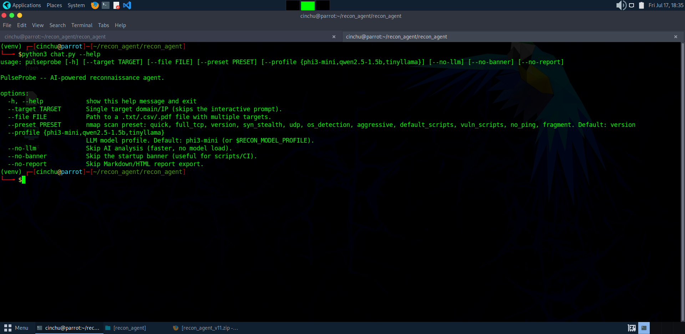
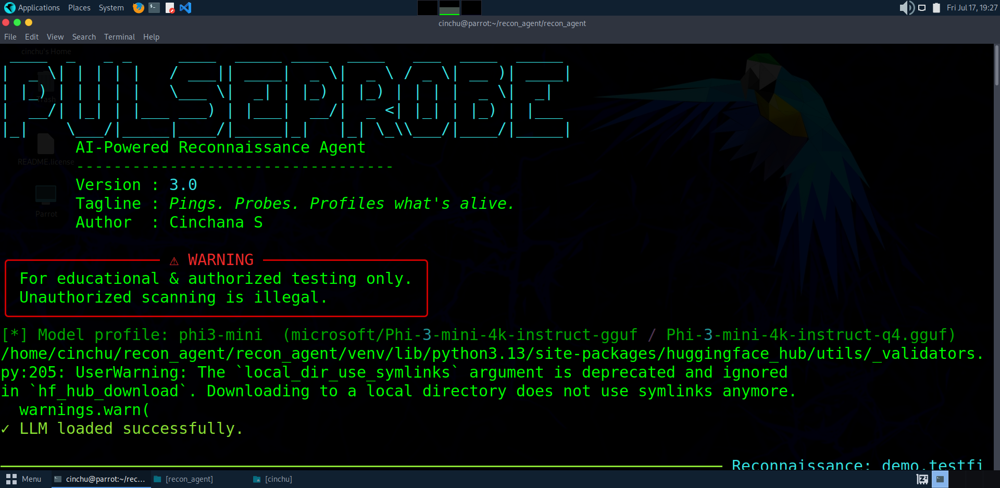
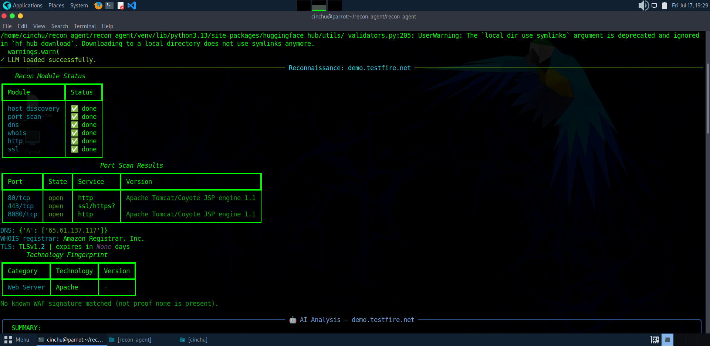
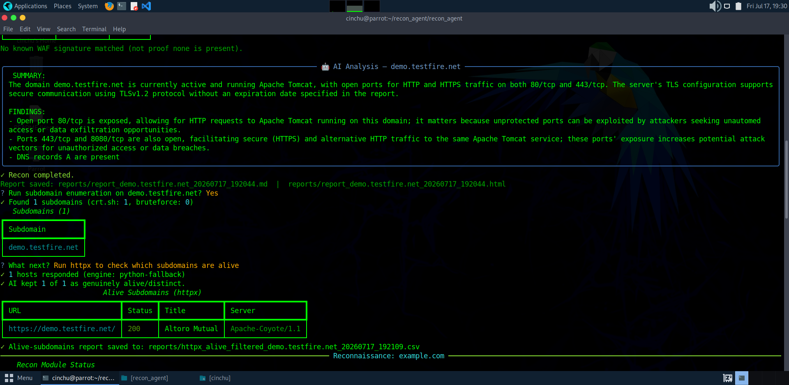

# PulseProbe

An AI-assisted reconnaissance agent for authorized security testing — pings,
probes, and profiles what's alive. Runs the standard recon toolkit (nmap, DNS,
WHOIS, HTTP, TLS, tech/WAF fingerprinting, subdomain enumeration) and uses a
locally-run, quantized LLM to turn raw scan output into a prioritized,
plain-English analysis with concrete next steps — no data leaves your machine.

> ⚠️ **For educational & authorized testing only.** Only run this against
> systems you own or have explicit written permission to test. Unauthorized
> scanning is illegal.

## Screenshots

**CLI usage & flags**


**Startup banner & model loading**


**Live module dashboard, port scan & tech fingerprint**


**AI analysis, subdomain enumeration & httpx probing**


**Second target — port scan, tech fingerprint & WAF detection**


**Second target — AI analysis with multiple subdomains found**


## Features

- **Host discovery** — nmap-based liveness check before deeper scanning
- **Port scanning** — full nmap flag coverage via named presets (quick, full TCP,
  SYN stealth, UDP, OS detection, aggressive, NSE scripts, etc.) or custom flags
- **DNS enumeration** — A/AAAA/MX/NS/TXT/CNAME/SOA records
- **WHOIS lookups** — registrar, expiry, name servers
- **HTTP header collection** — with HTTPS→HTTP fallback
- **SSL/TLS certificate inspection** — expiry, cipher suite, TLS version
- **Technology fingerprinting** — Wappalyzer/WhatWeb-style, categorized
  (CMS, web server, JS framework, analytics, CDN, programming language)
- **WAF detection** — passive signature matching (Cloudflare, Akamai, Imperva,
  Sucuri, AWS WAF, F5, and more)
- **Subdomain enumeration** — certificate-transparency (crt.sh) + DNS brute force
- **HTTP liveness probing** — via `httpx` (or a built-in Python fallback), with
  an AI review pass that filters out wildcard-DNS/parking-page false positives
- **File-based batch input** — feed it a single target, or a `.txt` / `.csv` /
  `.pdf` containing many
- **Local AI analysis** — runs entirely on-device via `llama.cpp`, streamed
  live inside the terminal UI; swappable model profile (see below)
- **Modern terminal UI** — colorized tables/panels via `rich`, a live status
  dashboard while modules run concurrently, and arrow-key menu prompts via
  `questionary` instead of raw y/n typing
- **CLI flags for automation** — run non-interactively with `--target`/`--file`
  for scripting or CI use, alongside the interactive REPL
- **Auto-generated reports** — every scan exports a self-contained Markdown
  and HTML report in addition to the terminal output

## Quick start

```bash
git clone <your-repo-url>
cd recon_agent
python3 -m venv venv
source venv/bin/activate
pip install --upgrade pip

# optional but recommended: build llama-cpp-python with BLAS acceleration
# sudo apt install libopenblas-dev
# CMAKE_ARGS="-DGGML_BLAS=ON -DGGML_BLAS_VENDOR=OpenBLAS" pip install -r requirements.txt
pip install -r requirements.txt

python3 chat.py
```

The first run downloads the configured model from Hugging Face (cached
under `~/.cache/huggingface`) and nothing else — the model runs locally
from then on.

## Model profiles

The LLM backend is a quantized GGUF model, selectable without touching code:

| Profile        | Size   | RAM needed | Notes                              |
|----------------|--------|------------|-------------------------------------|
| `phi3-mini`    | ~2.4GB | ~4GB       | **Default.** Best instruction-following |
| `qwen2.5-1.5b` | ~1GB   | ~1.5-2GB   | Good middle ground for tighter VMs |
| `tinyllama`    | ~0.7GB | ~1GB       | Fits almost anywhere, lowest quality |

Switch profiles with an environment variable — no code change needed:

```bash
export RECON_MODEL_PROFILE=qwen2.5-1.5b
python3 chat.py
```

## Requirements

- Python 3.9+
- [`nmap`](https://nmap.org/) installed and on `PATH`
- (Optional) [`httpx`](https://github.com/projectdiscovery/httpx) for faster/
  more accurate subdomain liveness probing — falls back to a pure-Python
  prober if not installed
- Some scan presets (SYN scan, OS detection, UDP) need raw-socket privileges:
  either run with `sudo`, or grant nmap the capability once:
  ```bash
  sudo setcap cap_net_raw,cap_net_admin+eip $(which nmap)
  ```

## Usage

**Interactive:**
```
TARGET > example.com                # single target
TARGET > targets.txt                # batch: one target per line
TARGET > scope.csv                  # batch: extracts domains/IPs from any cell
TARGET > client_scope.pdf           # batch: extracts domains/IPs from PDF text
TARGET > exit                       # quit
```

**Non-interactive (scripting/CI):**
```bash
python3 chat.py --target demo.testfire.net
python3 chat.py --file targets.txt --preset aggressive
python3 chat.py --target example.com --no-llm          # skip AI analysis, faster
python3 chat.py --target example.com --profile tinyllama --no-banner
```

Run `python3 chat.py --help` for the full flag list.

After each target's recon pass and AI analysis, you'll be prompted (arrow-key
menu, not raw typing):
1. Run subdomain enumeration? (crt.sh + DNS brute force)
2. If subdomains are found: probe liveness with `httpx` (with an AI pass to
   filter out wildcard/parking-page false positives), or just save the raw
   list to a file

Reports — a per-target Markdown + HTML summary, plus subdomain/httpx CSVs —
are saved under `reports/`.

## Project structure

```
recon_agent/
├── chat.py                 # entry point
├── agent.py                # orchestrator — runs modules concurrently, drives the interactive flow
├── requirements.txt
├── modules/
│   ├── host_discovery.py
│   ├── dns_enum.py
│   ├── whois_lookup.py
│   ├── port_scanner.py
│   ├── http_headers.py
│   ├── ssl_inspector.py
│   ├── tech_fingerprint.py
│   ├── subdomain_enum.py
│   └── httpx_probe.py
└── utils/
    ├── input_parser.py     # single target OR .txt/.csv/.pdf batch input
    ├── llm_analyzer.py     # prompt construction + streaming inference
    ├── report_writer.py    # saves Markdown/HTML/CSV reports to reports/
    └── ui.py                # rich tables/panels/live dashboard + questionary prompts
```

## Disclaimer

This tool is intended strictly for authorized penetration testing, security
research, and educational use. The author is not responsible for misuse.
Always obtain explicit written authorization before scanning any system you
do not own.
